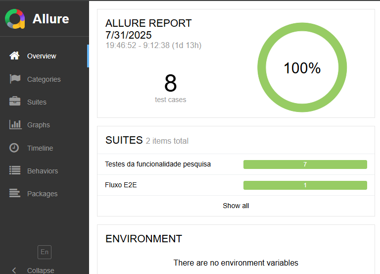

# 🧪 Teste Técnico - Automação Cypress

Este projeto contém testes automatizados para o blog do Agibank, desenvolvido com Cypress e integrado com Allure Reports para geração de relatórios detalhados.

## 📋 Descrição do Projeto

Este projeto de automação de testes foi desenvolvido para validar funcionalidades do blog do Agibank (`https://blog.agibank.com.br`), incluindo:

- **Funcionalidade de Pesquisa**: Testes para busca de conteúdo existente e inexistente
- **Navegação e Redirecionamento**: Validação de links e páginas do menu principal
- **Geração de Relatórios**: Integração com Allure Reports para visualização detalhada dos resultados



## 🚀 Funcionalidades Testadas

### 1. Pesquisa no Blog
- ✅ Busca com termo existente (ex: "Novas regras Pix: veja o que muda com as decisões do Banco Central?")
- ✅ Busca com termo inexistente (validação de mensagem de erro)

### 2. Navegação e Redirecionamento
- ✅ Menu "Serviços" → `/servicos`
- ✅ Menu "Suas finanças" → `/suas-financas`
- ✅ Menu "Seus benefícios" → `/seus-beneficios`
- ✅ Menu "Sua segurança" → `/sua-seguranca`
- ✅ Menu "Stories" → `/web-stories`

## 🛠️ Tecnologias Utilizadas

- **Cypress**: Framework de automação de testes
- **Allure Reports**: Geração de relatórios detalhados
- **JavaScript**: Linguagem de programação
- **Node.js**: Ambiente de execução

## 📦 Pré-requisitos

- Node.js (versão 14 ou superior)
- npm ou yarn

## ⚙️ Instalação

1. Clone o repositório:
```bash
git clone <url-do-repositorio>
```

2. Instale as dependências:
```bash
npm install
```

## 🎯 Como Executar os Testes

### Executar no Modo Interativo
```bash
npm run test:ui
```
Abre o Cypress Test Runner para execução interativa dos testes.

### Executar no Modo Headless
```bash
npm run e2e
```
Executa todos os testes em modo headless com geração de relatórios Allure.

### Gerar Relatório Allure
```bash
npm run report:allure
```
Gera e abre o relatório Allure com os resultados dos testes.

### Executar Testes + Relatório
```bash
npm run test:allure
```
Executa os testes e gera o relatório automaticamente.

## 📁 Estrutura do Projeto

```
baseCypress/
├── cypress/
│   ├── e2e/
│   │   ├── pesquisaBlog.cy.js      # Testes de funcionalidade de pesquisa
│   │   └── redirecionamento.cy.js  # Testes de navegação e redirecionamento
│   ├── fixtures/
│   │   ├── dados.json              # Dados de teste
│   │   └── mockRequestCdn          # Mock para requisições CDN
│   └── support/
│       └── commands.js             # Comandos customizados do Cypress
├── allure-results/                 # Resultados dos testes (gerado automaticamente)
├── allure-report/                  # Relatórios Allure (gerado automaticamente)
├── cypress.config.js               # Configuração do Cypress
└── package.json                    # Dependências e scripts
```

## 🔧 Configurações

### Cypress Configuration (`cypress.config.js`)
- **Base URL**: `https://blog.agibank.com.br`
- **Viewport**: 1600x900
- **Timeout**: 10 segundos
- **Retries**: 1 tentativa
- **Vídeo**: Habilitado

### Comandos Customizados
- `cy.realizarBusca(texto)`: Executa uma busca no blog
- `cy.aguardarPaginaCarregar()`: Aguarda o carregamento completo da página

## 📊 Relatórios

O projeto utiliza Allure Reports para gerar relatórios detalhados incluindo:
- Status dos testes (pass/fail)
- Screenshots de falhas
- Vídeos das execuções
- Tempo de execução
- Logs detalhados

## 🧪 Dados de Teste

Os dados de teste estão localizados em `cypress/fixtures/dados.json`:
- `pesquisaExistente`: Termo de busca que retorna resultados
- `pesquisaInexistente`: Termo de busca que não retorna resultados

## 🔄 CI/CD (Continuous Integration/Continuous Deployment)

Este projeto está configurado com GitHub Actions para automação completa do processo de testes.

### 📋 Workflow de CI/CD

O workflow está localizado em `.github/workflows/cypress-tests.yml` e inclui:

#### 🚀 **Triggers (Gatilhos)**
- **Push para master**: Executa testes automaticamente em cada push
- **Pull Request**: Valida testes antes do merge
- **Agendamento**: Execução diária às 09:00 UTC para monitoramento contínuo

#### ⚙️ **Etapas do Pipeline**

1. **Checkout do código**
   - Faz checkout do repositório

2. **Setup do ambiente**
   - Configura Node.js versão 18
   - Instala dependências com `npm ci`

3. **Execução dos testes**
   - Executa testes Cypress no Chrome
   - Gera relatórios Allure automaticamente

4. **Artefatos**
   - Upload de resultados dos testes
   - Upload de relatórios Allure
   - Upload de vídeos e screenshots

5. **Notificações**
   - Notificação no Slack em caso de falha
   - Link direto para o relatório de execução

### 📈 **Métricas e Relatórios**

O CI/CD gera automaticamente:
- **Status dos testes**: Pass/Fail para cada execução
- **Tempo de execução**: Performance dos testes
- **Cobertura**: Relatórios de cobertura (se configurado)
- **Trends**: Histórico de execuções
- **Artefatos**: Vídeos, screenshots e logs

### 🛠️ **Configurações Avançadas**

#### Variáveis de Ambiente
```yaml
# Secrets necessários no GitHub
SLACK_WEBHOOK_URL: URL do webhook do Slack
```